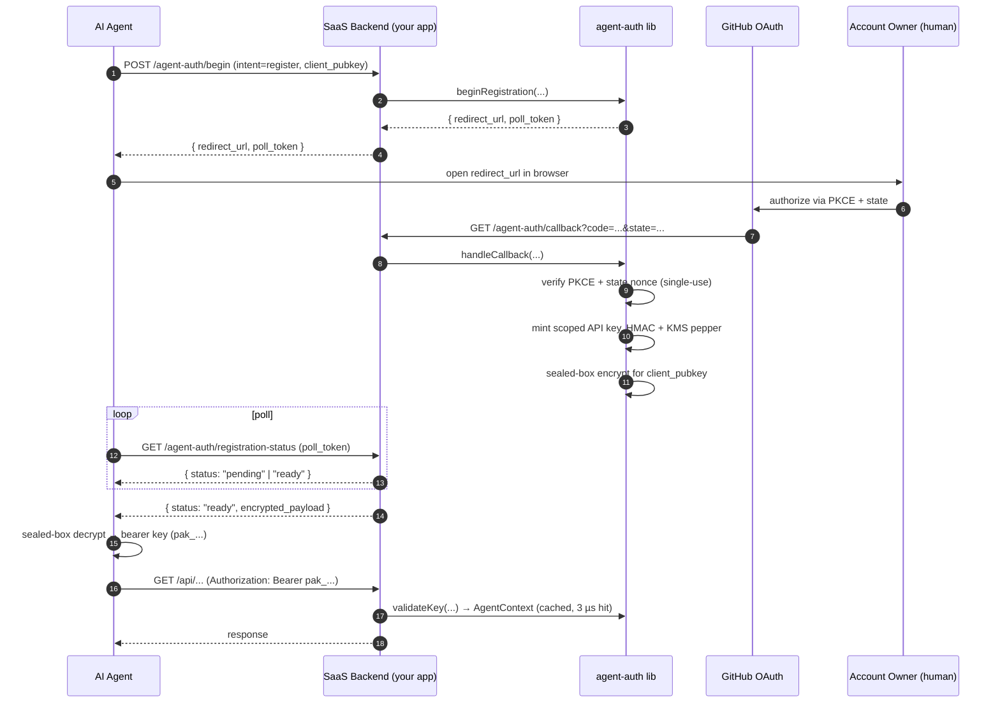

<div align="center">

# Vouch

**Identity infrastructure for AI agents.**
**Drop it next to your existing human auth — never replaces it.**

<sub>The open-source engine ships as the `agent-auth` package on npm (v0.2). Hosted Vouch Cloud is on the [roadmap](#roadmap) for v1.0.</sub>

[](https://github.com/shizhigu/agent-auth/actions/workflows/ci.yml)
[](https://github.com/shizhigu/agent-auth/actions/workflows/security.yml)
[](LICENSE)
[](https://nodejs.org)
[](https://www.typescriptlang.org/)
[](#testing)

[Status](#project-status) ·
[Why](#why-vouch) ·
[Comparison](#comparison-vs-better-auth--auth0--clerk--nango) ·
[Quick start](#quick-start) ·
[How it works](#how-it-works) ·
[Architecture](#architecture) ·
[Roadmap](#roadmap)

</div>

---

## Project status

**Server-side engine: feature-complete (v0.1).** All 8 milestones shipped — `355` unit · `94` integration · `14` chaos tests passing at HEAD. Spec audited across 13 rounds with codex / GPT-5; final grade A (production-ready paying-customer level).

**What is NOT shipped yet** — and why this matters for you:

| | Status | Plan |
|---|---|---|
| Published on npm (`agent-auth` package) | **No** — install today via `git clone && npm run build` | v0.2 |
| Agent-side SDK (`@vouch/client`) | **Dev preview** — lives in [`packages/client/`](packages/client/) (not yet on npm) | v0.2 |
| CLI scaffolder (`npx create-vouch-app`) | **Yes** — Express SaaS or Node agent in one command, ready to run | shipped |
| Reference end-to-end demo (SaaS + agent) | **Yes** — runnable in `apps/demo/` (Postgres + Redis via docker compose, no AWS / GitHub OAuth needed) | v0.2 |
| Docs site (`vouch.dev`) | **No** — README + SPEC only | v0.2 |
| Multi-provider identity (Google / GitLab / generic OIDC) | **No** — GitHub-only at v0.1 | v0.3 |
| Migration runner (`vouch migrate up`) | **Yes** — `@vouch/cli` ships forward + rollback + status; tracking table auto-created | shipped |
| Vouch Cloud (hosted + admin dashboard) | **No** — self-host only | v1.0 |

If you want to **try it today**, see [Quick start](#quick-start). If you want to **build production on top of it**, the realistic ETA is **v0.2 (~4 weeks)** when DX completes — the server-side core is solid, but the rough edges are real.

## Why Vouch

Today's "agent signup" stories don't hold up:

- **CAPTCHAs and email verification** block headless flows
- **Browser automation** (the "have the agent click around") is brittle, slow, and a security nightmare
- **Sharing a human's password** is unauditable, can't be scoped, and can't be instantly revoked

Vouch solves this by giving the agent **its own first-class identity** — rooted in a human's existing GitHub login, scoped to a single tenant, with full audit trail and instant revocation. You drop the engine into your SaaS backend; your existing human auth keeps working unchanged.

```ts
// Existing human auth — UNTOUCHED
app.use('/api/v1', humanAuth.middleware);    // sets req.user

// New agent auth — lives on req.agent (per SPEC §6.3 confused-deputy prevention)
app.use('/api/agent/v1', agentAuthMiddleware);

app.get('/api/agent/v1/data', (req, res) => {
  req.agent.require_scope('read');                    // throws 403 on miss
  return queryDb({ tenant_id: req.agent.account_id }); // RT-9 tenant isolation
});
```

## Comparison vs Better Auth / Auth0 / Clerk / Nango

Vouch is **complementary** to existing auth tools, not a competitor. It plugs a gap none of them cover today.

### Quick map

> - **Better Auth · Auth0 · Clerk · Lucia** → "humans log into your SaaS"
> - **Nango · Arcade · Auth0 for AI Agents** → "your code calls third-party APIs (Slack, GDrive, …) on behalf of an authenticated human"
> - **Vouch (this)** → "AI agents register accounts on YOUR SaaS and get their own scoped API keys"
>
> If you're building Acme SaaS and want Claude Code / Cursor / Codex to autonomously sign up for an Acme account on a human's behalf and call the Acme API: **Vouch fills that gap**. None of the others do.

### Detailed table

| | **Better Auth · Lucia** | **Auth0 · Clerk** | **Nango · Arcade · Auth0-for-AI-Agents** | **Vouch (this)** |
|---|---|---|---|---|
| **Whose identity** | the human | the human | the human (token forwarded to 3rd-party APIs) | the agent itself |
| **You are the…** | service humans log into | service humans log into | service that calls 3rd-party APIs | service the agent calls |
| **Hosted option** | Better Auth Cloud | Yes (default) | Yes | Vouch Cloud (v1.0); self-host only today |
| **DB ownership** | your DB | their DB | your DB | your DB |
| **Headless agent flow** | n/a | n/a | partial (token broker) | designed for it (PKCE + sealed-box) |
| **API key issuance** | session cookies primarily | sessions / JWT / API keys | n/a | API keys (scoped, rotatable, instantly revocable) |
| **Audit chain (cryptographic)** | basic logs | yes (paid) | basic logs | append-only hash chain + WORM mirror |
| **Multi-tenant by default** | yes | yes | yes | yes (`req.agent.account_id` enforced) |
| **Self-hostable** | yes | no | yes (some) | yes (only mode at v0.1) |
| **Supply-chain hardening** | varies | n/a | varies | OIDC publish + Sigstore + SBOM + Scorecard |

### What Vouch is NOT

- Not a replacement for Clerk / Auth0 / Better Auth — those handle **human** auth.
- Not browser automation — Browserbase / Skyvern occupy that space.
- Not an agent governance / observability platform.
- Not a token vault for already-authorized SaaS APIs.
- Not a marketplace or payment rail for agents.

## Features

- **Drop-in middleware** for Express, Hono, and any framework via the framework-agnostic core. Adapters take 5 lines each.
- **Two-stage trust** — registration via GitHub OAuth + PKCE; runtime validation via HMAC + KMS-held pepper. No Argon2id at the hot path (3 µs cache hit, 6.5 µs cache miss in benchmarks).
- **Sealed-box key delivery** (libsodium `crypto_box_seal`) — the agent's pubkey gates the one-shot key drop. Stolen poll tokens cannot extract the key.
- **Postgres-authoritative** with Redis as 30-second-bounded cache. Worst-case staleness is provable; correctness never depends on Redis alone.
- **Tier B durability** — high-stakes mutations use `synchronous_commit=remote_apply` + two-phase idempotency. Network blips during commit produce deterministic outcomes (`completed` / `failed` / `unknown`), never silent loss.
- **Append-only audit chain** — Postgres trigger derives `prev_hash`/`row_hash`; hourly verifier walks the chain; WORM mirror in S3 Object Lock for SOC 2 / GDPR.
- **Multi-region active-passive** with LSN barrier + timeline-aware revocation. Failover playbook (RB-8) included.
- **Instant revocation** — Postgres write + Redis epoch bump + pubsub broadcast invalidates every cache in < 30 s.
- **GCRA rate limiting** at the edge (Lua atomic in Redis) with multi-dimensional per-IP / per-account / per-tenant short-circuits.
- **44-threat threat model** mapped to controls; 32 with automated tests (unit / integration / chaos / property), 11 explicitly operational, 1 reserved.
- **9 admin runbooks** (RB-1..RB-9) covering revocation drift, oncall paging, KMS key rotation, cross-region failover, etc.

## Quick start

> **Heads up** — packages aren't on npm yet. Until v0.2 publishes, scaffold from this repo by passing `--template-dir` to `create-vouch-app` or install via `file:` link.

### One command (when published)

```bash
npx create-vouch-app my-saas
cd my-saas
cp .env.example .env
docker compose up -d
npx vouch migrate up
npm install
npm run dev
```

That's it — `create-vouch-app` writes a working Express SaaS template, `vouch migrate up` applies the schema, `npm run dev` starts the server with hot reload. See [`packages/create-vouch-app`](packages/create-vouch-app/) for templates (`saas-express`, `agent`).

### Install from source (today, pre-npm-publish)

```bash
git clone https://github.com/shizhigu/agent-auth.git
cd agent-auth
npm install && npm run build
# Then in your SaaS project:
npm install /path/to/agent-auth
```

### Apply the database schema

```bash
npm install -D @vouch/cli
DATABASE_URL=postgres://… npx vouch migrate up
```

`vouch migrate status` shows pending vs applied; `vouch migrate down --steps 1` rolls back. Tracking lives in a `vouch_migrations` table the CLI creates automatically. See [`packages/cli/README.md`](packages/cli/README.md) for the full reference.

### Wire it up (Express)

```ts
import express from 'express';
import { vouch } from 'agent-auth';

declare module 'express-serve-static-core' {
  interface Request {
    agent?: import('agent-auth').AgentContext; // NOT req.user — see SPEC §6.3
  }
}

const auth = await vouch({
  database: { url: process.env.DATABASE_URL! },
  redis: { url: process.env.REDIS_URL! },
  kms: {
    provider: 'aws',
    region: 'us-east-1',
    pepper_alias: 'alias/vouch-pepper',
    device_alias: 'alias/vouch-device-flow',
    pepperFetcher: async (v) => /* read pepper bytes from KMS */ Buffer.alloc(32),
  },
  identity: {
    github: {
      client_id: process.env.GH_CLIENT_ID!,
      client_secret: process.env.GH_CLIENT_SECRET!,
      webhook_secret: process.env.GH_WEBHOOK_SECRET!,
      app_private_key_pem: process.env.GH_APP_PRIVATE_KEY!,
    },
  },
  internal_secret: process.env.AGENT_AUTH_INTERNAL_SECRET!,  // base64
  base_url: process.env.PUBLIC_BASE_URL!,
});

const app = express();
auth.express.mount(app);                                     // /agent-auth/*
app.use('/api/agent/v1', auth.express.middleware());         // protect your API

app.get('/api/agent/v1/whoami', (req, res) => {
  res.json({ account_id: req.agent!.account_id, scopes: req.agent!.scopes });
});

app.listen(8080);
```

That's it — `vouch()` builds Postgres / Redis / KMS adapters, wires the 12 lifecycle routes (`begin-registration`, `callback`, `registration-status`, `rotate-key`, `revoke`, `recover-account*`, `webhooks/:provider`, `healthz`, `well-known`, `list-keys`), handles raw-body parsing for webhook signature verification, and runs `redis.loadScripts()` + `sealedBoxReady()` for you.

### Same wiring on Hono

Vouch ships a Hono adapter for Bun / Cloudflare Workers / Deno deployments. Same `vouch()` call, then:

```ts
import { Hono } from 'hono';
import { vouch } from 'agent-auth';
import { honoRoutes, honoAppMiddleware } from 'agent-auth/hono';

const auth = await vouch({ /* same config as above */ });

const app = new Hono();
app.route('/agent-auth', honoRoutes(auth));            // lifecycle routes
app.use('/api/agent/v1/*', honoAppMiddleware(auth));   // protect your API

app.get('/api/agent/v1/whoami', (c) => {
  const agent = c.get('agent');
  return c.json({ account_id: agent.account_id, scopes: agent.scopes });
});
```

The Hono router is built off the same framework-agnostic `auth.lifecycle` that backs Express, so behavior is identical down to the route bodies and error shapes.

For the **agent side**, use [`@vouch/client`](packages/client/) — 5 lines from `register()` to authenticated `fetch()`:

```ts
import { register } from '@vouch/client';

const vouch = await register({
  saas_url: 'https://my-saas.com',
  provider: 'github_app',
  onChallengeUrl: (url) => console.log('Authorize at:', url),
});

const me = await vouch.fetch('/api/agent/v1/whoami').then((r) => r.json());
```

Need full control over adapters (custom Pool, BYO Redis, audit WORM, etc.)? See [`examples/express-integration.ts`](examples/express-integration.ts) for the manual wiring path. Need to try it locally first? See [`apps/demo/`](apps/demo/) — Postgres + Redis via docker compose, runs end-to-end in 5 minutes.

## How it works

The registration flow (the part that actually sets agent-auth apart):



For revocation, rotation, recovery, and multi-region paths, see the corresponding sections of [`SPEC.md`](SPEC.md).

## Architecture

| Component | Role | Why |
|---|---|---|
| **Postgres 16** | authoritative state — accounts, agents, keys, audit chain | Strong consistency, transactional safety. All Tier B writes use `synchronous_commit=remote_apply`. |
| **Redis 7** | cache (30 s bounded) + pubsub fan-out for revocations | Sub-millisecond hot path. Correctness never depends on Redis alone (RT-3, RT-26). |
| **AWS KMS** | pepper for HMAC; envelope keys for sealed-box delivery | Pepper rotates weekly; legacy versions accepted within a 7-day dual-window. |
| **AWS S3 (Object Lock)** | WORM mirror of audit chain | SOC 2 / GDPR — immutable evidence even against an admin-role attacker (RT-12, RT-39). |
| **GitHub App / OAuth** | identity provider | Default in v0.1; the lib is provider-agnostic — you can implement `IdentityProvider` for SAML / OIDC / etc. |

### Role separation

`agent-auth` ships **four Postgres roles** that the SaaS connects with depending on the operation:

| Role | Used by | Permissions |
|---|---|---|
| `agent_auth_migrator` | one-shot DDL on deploy | full DDL, then dropped from the connection pool |
| `agent_auth_app` | request-path validation + Tier A reads | SELECT + INSERT on most tables; **no UPDATE / DELETE** on `agent_audit_log` |
| `agent_auth_admin` | admin runbooks (RB-1..RB-9) | privileged writes guarded by JIT-RBAC + two-person approval |
| `agent_auth_readonly` | reporting / forensics | SELECT only |

Per the threat model (`SPEC.md` Part VI), the app role cannot tamper with audit history even if compromised — append is the only op it has.

## Documentation

| | |
|---|---|
| [`SPEC.md`](SPEC.md) | The comprehensive specification — start here for implementation details, threat model, ADRs, runbooks |
| [`docs/MIGRATION_GUIDE.md`](docs/MIGRATION_GUIDE.md) | Upgrade walkthrough for SaaS adopters (post-v0.1 sweep) |
| [`docs/PRE_RELEASE_CHECKLIST.md`](docs/PRE_RELEASE_CHECKLIST.md) | Release gate (mirror of SPEC §12.7) |
| [`docs/runbooks/INDEX.md`](docs/runbooks/INDEX.md) | RB-1..RB-9 incident playbooks |
| [`docs/security/OWASP-API-self-review.md`](docs/security/OWASP-API-self-review.md) | OWASP API 2023 mapping |
| [`audit/`](audit/) | 13 rounds of design-audit history (preserved for rationale) |
| [`examples/`](examples/) | Express, Hono, and worker-cronjob templates |
| [`packages/vouch/schema/migrations/`](packages/vouch/schema/migrations/) | Forward + rollback SQL DDL (0001..0006) |

## Testing

Four-tier test pyramid; all four pass at HEAD.

| Tier | Count | Wall | What it covers |
|---|---|---|---|
| **Unit** (vitest + fast-check) | 355 / 49 suites | ~600 ms | Algorithm shape, error mapping, property invariants (GCRA · audit chain · idempotency state machine · canonical hashing). |
| **Integration** (testcontainers Postgres 16 + Redis 7) | 94 / 27 suites | ~95 s | Real DB triggers, cross-region barrier, audit partition manager, RT-* threats end-to-end. |
| **Chaos** (testcontainers + injected faults) | 14 / 5 suites | ~10 s | RT-15 DoS · RT-18/32/34 multi-region failover · RT-22 KMS unavailable · RT-25 Redis partition · RT-43 fail-closed amplification. |
| **Bench** (vitest bench) | 2 | ~5 s | `validation_cache_hit` P99 = 3.2 µs (target 50 ms) · `validation_cache_miss + HMAC` P99 = 6.5 µs (target 100 ms). |

```bash
npm install
npm run lint
npm run typecheck
npm test                     # unit
npm run test:integration     # needs Docker (testcontainers)
npm run test:chaos           # needs Docker
npm run bench
```

## Roadmap

The server-side engine is done; the next milestones are about **developer experience parity with Better Auth / Auth0**.

### v0.2 — DX completeness (next ~4 weeks)

- [ ] **`agent-auth` published on npm** — currently dev-only
- [x] **`@vouch/client` dev preview** — agent-side SDK lives in [`packages/client/`](packages/client/); 5-line `register()` happy path; auto-rotation deferred to v0.3
- [ ] **`@vouch/client` published on npm**
- [x] **`npx create-vouch-app`** — scaffolder; templates: `saas-express` (default) and `agent`
- [x] **Reference end-to-end demo** — see [`apps/demo/`](apps/demo/) (SaaS + agent runnable via `docker compose up && npm run saas && npm run agent`)
- [ ] **Docs site at `vouch.dev`** — VitePress / Nextra with copy-paste recipes
- [ ] OTel tracing (`src/observability/tracing.ts`)
- [ ] Idempotency middleware sugar (wraps `tierBIdempotent` for HTTP routes)
- [ ] GitHub device-flow as alt registration path

### v0.3 — Multi-provider + tooling

- [ ] Generic OIDC provider — works against any standards-compliant IdP
- [ ] Built-in providers: Google Workspace, GitLab, Microsoft Entra
- [x] **`vouch migrate up`** — first-class migration runner (`@vouch/cli`); ships forward + rollback + status, transactional with auto tracking table
- [ ] Type inference end-to-end (server-defined scopes flow into agent-side `useAgent()` hook)

### v1.0 — Vouch Cloud

- [ ] **Vouch Cloud** — managed control plane (you keep your DB; we run the validation hot path)
- [ ] **Admin web dashboard** — keys / agents / audit / runbooks UI (today: CLI only)
- [ ] Customer reference deployment with SOC 2 attestation
- [ ] 30-day staging replay automated against production-shape data

### v0.1.x — Maintenance

- Bug fixes from real deployments
- Worker / reaper hardening
- No new features

## Status

| | |
|---|---|
| **Version** | v0.1 (server-side complete) |
| **DX completeness** | ~30% — see [Project status](#project-status) for the gap list |
| **Spec audit grade** | A (production-ready paying-customer level, per 13 rounds with codex / GPT-5) |
| **Threats covered with tests** | 32 of 44 RT-* (11 explicitly operational, 1 reserved) |
| **OWASP API 2023** | All 10 risks mapped — see `docs/security/OWASP-API-self-review.md` |
| **Compliance posture** | SOC 2 / GDPR-ready audit trail; deploying SaaS owns the actual audit |
| **License** | MIT |

## Stack

Node.js 20+ (Bun-compatible) · TypeScript 5.4 strict · libsodium · pg · ioredis · @aws-sdk/client-{kms,s3} · zod · vitest · testcontainers · fast-check.

## Contributing

Vouch is **roadmap-driven**. The current focus is v0.2 (DX completeness — see [Roadmap](#roadmap)). Contributors are very welcome:

- **Bug reports and security findings** — open an [Issue](https://github.com/shizhigu/agent-auth/issues), or for vulnerabilities follow [`SECURITY.md`](SECURITY.md) (private advisory).
- **Bug-fix PRs** — please open an issue first so we can align on the fix shape; PRs with linked issues get fast-tracked.
- **Feature PRs** — we evaluate against the roadmap. For anything that touches `SPEC.md`, the threat model, or `packages/vouch/src/crypto/` / `packages/vouch/src/middleware/validate-key.ts` / `packages/vouch/src/distributed/`, please open an issue first to discuss the design before writing code. An ADR in Appendix B is required for spec-touching changes (see ADR-001..ADR-014 for the format).
- **Good first issues** — labeled in the [issue tracker](https://github.com/shizhigu/agent-auth/issues?q=is%3Aopen+label%3A%22good+first+issue%22).

We aim to respond to issues and PRs within **a few business days**. Auth is supply-chain-sensitive — review depth matters more than throughput, so please be patient if a PR sits in review for a beat.

## License

[MIT](LICENSE) © 2026 Agentic Flow LLC

---

<div align="center">
<sub><b>Vouch</b> is built by <a href="https://github.com/shizhigu">Agentic Flow LLC</a>. The open-source engine ships as <code>agent-auth</code> on npm (v0.2). Hosted Vouch Cloud is on the <a href="#roadmap">roadmap</a>.</sub>
</div>
