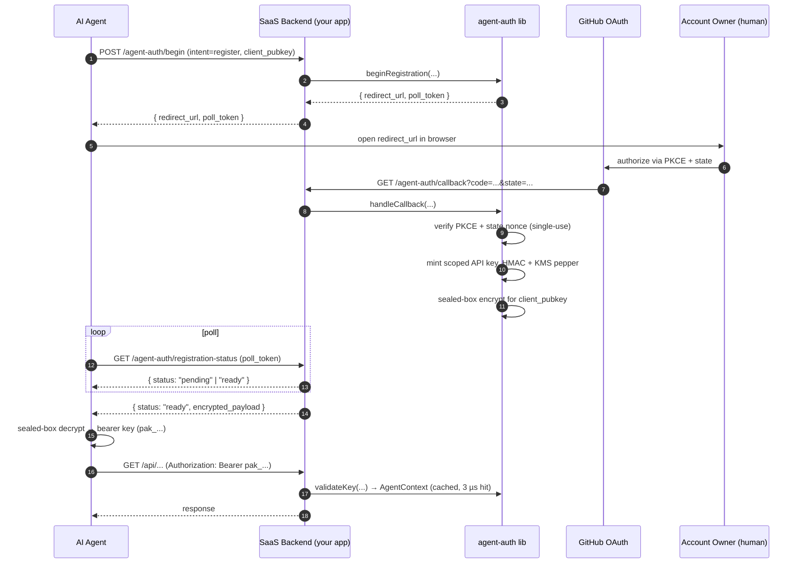

<div align="center">

# agent-auth

**Production-grade auth rail for AI agents.**
**Sits next to your existing human auth — never replaces it.**

[](https://github.com/shizhigu/agent-auth/actions/workflows/ci.yml)
[](https://github.com/shizhigu/agent-auth/actions/workflows/security.yml)
[](LICENSE)
[](https://nodejs.org)
[](https://www.typescriptlang.org/)
[](#testing)
[](https://github.com/shizhigu)
[](#contributing)

[Status](#project-status) ·
[Why](#why-agent-auth) ·
[Comparison](#comparison-vs-better-auth--auth0--clerk--nango) ·
[Quick start](#quick-start) ·
[How it works](#how-it-works) ·
[Architecture](#architecture) ·
[Roadmap](#roadmap)

</div>

---

## Project status

**Server-side library: feature-complete (v0.1).** All 8 milestones shipped — `355` unit · `94` integration · `14` chaos tests passing at HEAD. Spec audited across 13 rounds with codex / GPT-5; final grade A (production-ready paying-customer level).

**What is NOT shipped yet** — and why this matters for you:

| | Status | Plan |
|---|---|---|
| Published on npm | **No** — install today via `git clone && npm run build` | v0.2 |
| Agent-side SDK (`@agent-auth/client`) | **No** — agents currently implement PKCE + sealed-box decrypt + bearer-key auto-rotation themselves | v0.2 |
| CLI scaffolder (`npx create-agent-auth-app`) | **No** | v0.2 |
| Reference end-to-end demo (SaaS + agent) | **No** — only SaaS-side examples | v0.2 |
| Docs site (`agent-auth.dev`) | **No** — README + SPEC only | v0.2 |
| Multi-provider identity (Google / GitLab / generic OIDC) | **No** — GitHub-only at v0.1 | v0.3 |
| Migration runner (`agent-auth migrate up`) | **No** — apply `schema/migrations/*.sql` manually | v0.3 |
| Hosted version (`agent-auth Cloud`) + admin dashboard | **No** — self-host only | v1.0 |

If you want to **try it today**, see [Quick start](#quick-start). If you want to **build production on top of it**, the realistic ETA is **v0.2 (~4 weeks)** when DX completes — the server-side core is solid, but the rough edges are real.

## Why agent-auth

Today's "agent signup" stories don't hold up:

- **CAPTCHAs and email verification** block headless flows
- **Browser automation** (the "have the agent click around") is brittle, slow, and a security nightmare
- **Sharing a human's password** is unauditable, can't be scoped, and can't be instantly revoked

`agent-auth` solves this by giving the agent **its own first-class identity** — rooted in a human's existing GitHub login, scoped to a single tenant, with full audit trail and instant revocation. You drop the library into your SaaS backend; your existing human auth keeps working unchanged.

```ts
// Existing human auth — UNTOUCHED
app.use('/api/v1', humanAuth.middleware);    // sets req.user

// New agent auth — lives on req.agent (per SPEC §6.3 confused-deputy prevention)
app.use('/api/agent/v1', agentAuthMiddleware);

app.get('/api/agent/v1/data', (req, res) => {
  req.agent.require_scope('read');                    // throws 403 on miss
  return queryDb({ tenant_id: req.agent.account_id }); // RT-9 tenant isolation
});
```

## Comparison vs Better Auth / Auth0 / Clerk / Nango

`agent-auth` is **complementary** to existing auth tools, not a competitor. It plugs a gap none of them cover today.

### Quick map

> - **Better Auth · Auth0 · Clerk · Lucia** → "humans log into your SaaS"
> - **Nango · Arcade · Auth0 for AI Agents** → "your code calls third-party APIs (Slack, GDrive, …) on behalf of an authenticated human"
> - **agent-auth (this)** → "AI agents register accounts on YOUR SaaS and get their own scoped API keys"
>
> If you're building Acme SaaS and want Claude Code / Cursor / Codex to autonomously sign up for an Acme account on a human's behalf and call the Acme API: **agent-auth fills that gap**. None of the others do.

### Detailed table

| | **Better Auth · Lucia** | **Auth0 · Clerk** | **Nango · Arcade · Auth0-for-AI-Agents** | **agent-auth (this)** |
|---|---|---|---|---|
| **Whose identity** | the human | the human | the human (token forwarded to 3rd-party APIs) | the agent itself |
| **You are the…** | service humans log into | service humans log into | service that calls 3rd-party APIs | service the agent calls |
| **Hosted option** | Better Auth Cloud | Yes (default) | Yes | No (self-host only at v0.1; Cloud is v1.0) |
| **DB ownership** | your DB | their DB | your DB | your DB |
| **Headless agent flow** | n/a | n/a | partial (token broker) | designed for it (PKCE + sealed-box) |
| **API key issuance** | session cookies primarily | sessions / JWT / API keys | n/a | API keys (scoped, rotatable, instantly revocable) |
| **Audit chain (cryptographic)** | basic logs | yes (paid) | basic logs | append-only hash chain + WORM mirror |
| **Multi-tenant by default** | yes | yes | yes | yes (`req.agent.account_id` enforced) |
| **Self-hostable** | yes | no | yes (some) | yes (only mode at v0.1) |
| **Supply-chain hardening** | varies | n/a | varies | OIDC publish + Sigstore + SBOM + Scorecard |

### What agent-auth is NOT

- Not a replacement for Clerk / Auth0 / Better Auth — those handle **human** auth.
- Not browser automation — Browserbase / Skyvern occupy that space.
- Not an agent governance / observability platform.
- Not a token vault for already-authorized SaaS APIs.
- Not a marketplace or payment rail for agents.

## Features

- **Drop-in middleware** for Express, Hono, and any framework via the framework-agnostic core. Adapters take 5 lines each.
- **Two-stage trust** — registration via GitHub OAuth + PKCE; runtime validation via HMAC + KMS-held pepper. No Argon2id at the hot path (3 µs cache hit, 6.5 µs cache miss in benchmarks).
- **Sealed-box key delivery** (libsodium `crypto_box_seal`) — the agent's pubkey gates the one-shot key drop. Stolen poll tokens cannot extract the key.
- **Postgres-authoritative** with Redis as 30-second-bounded cache. Worst-case staleness is provable; correctness never depends on Redis alone.
- **Tier B durability** — high-stakes mutations use `synchronous_commit=remote_apply` + two-phase idempotency. Network blips during commit produce deterministic outcomes (`completed` / `failed` / `unknown`), never silent loss.
- **Append-only audit chain** — Postgres trigger derives `prev_hash`/`row_hash`; hourly verifier walks the chain; WORM mirror in S3 Object Lock for SOC 2 / GDPR.
- **Multi-region active-passive** with LSN barrier + timeline-aware revocation. Failover playbook (RB-8) included.
- **Instant revocation** — Postgres write + Redis epoch bump + pubsub broadcast invalidates every cache in < 30 s.
- **GCRA rate limiting** at the edge (Lua atomic in Redis) with multi-dimensional per-IP / per-account / per-tenant short-circuits.
- **44-threat threat model** mapped to controls; 32 with automated tests (unit / integration / chaos / property), 11 explicitly operational, 1 reserved.
- **9 admin runbooks** (RB-1..RB-9) covering revocation drift, oncall paging, KMS key rotation, cross-region failover, etc.

## Quick start

> **Heads up** — `agent-auth` is not on npm yet. Install today is from source; v0.2 will publish.

### Install (today, from source)

```bash
git clone https://github.com/shizhigu/agent-auth.git
cd agent-auth
npm install
npm run build
# Then in your SaaS project:
npm install /path/to/agent-auth
# OR use `npm link` for an in-development workflow.
```

You'll also need the runtime peers:

```bash
npm install pg ioredis @aws-sdk/client-kms libsodium-wrappers
# Plus your framework of choice:
npm install express        # for the Express adapter
# OR
npm install hono           # for the Hono adapter
```

### Apply the database schema

There's no migration runner yet (v0.3); apply the SQL files manually in order:

```bash
psql "$DATABASE_URL" -f schema/migrations/0001_init.sql
psql "$DATABASE_URL" -f schema/migrations/0002_audit.sql
psql "$DATABASE_URL" -f schema/migrations/0003_revocation.sql
psql "$DATABASE_URL" -f schema/migrations/0004_idempotency.sql
psql "$DATABASE_URL" -f schema/migrations/0005_audit_chain_utc.sql
psql "$DATABASE_URL" -f schema/migrations/0006_recover_pending_approval.sql
```

### Mount the middleware (Express)

```ts
import express from 'express';
import { Pool } from 'pg';
import { Redis } from 'ioredis';
import { KMSClient } from '@aws-sdk/client-kms';
import {
  resolveConfig,
  expressMiddleware,
  makeValidateKeyDeps,
  PostgresAdapter,
  IoredisAdapter,
  AwsKmsAdapter,
  type AgentContext,
} from 'agent-auth';
import { GitHubAppProvider } from 'agent-auth/identity/github-app/browser-flow.js';

declare module 'express' {
  interface Request {
    agent?: AgentContext;     // NOT req.user — see SPEC §6.3
  }
}

// 1. Adapters
const pg = new PostgresAdapter({
  pool: new Pool({ connectionString: process.env.DATABASE_URL! }),
  role: 'agent_auth_app',
});
const redisClient = new Redis(process.env.REDIS_URL!);
const redis = new IoredisAdapter({
  client: redisClient,
  subscriber: redisClient.duplicate(),
});
await redis.loadScripts();
const kms = new AwsKmsAdapter({
  client: new KMSClient({ region: 'us-east-1' }),
  pepper_key_alias: 'alias/agent-auth-pepper',
  device_key_alias: 'alias/agent-auth-device-flow',
  current_version: 1,
  pepperFetcher: async (v) => /* read pepper bytes from KMS */ Buffer.alloc(32),
});

// 2. Config + dep tree
const config = resolveConfig({
  internal_secret: Buffer.from(process.env.AGENT_AUTH_INTERNAL_SECRET!, 'base64'),
  identity_providers: [
    new GitHubAppProvider({
      client_id: process.env.GH_CLIENT_ID!,
      client_secret: process.env.GH_CLIENT_SECRET!,
      webhook_secret: process.env.GH_WEBHOOK_SECRET!,
      app_private_key_pem: process.env.GH_APP_PRIVATE_KEY!,
    }),
  ],
  storage: { postgres: pg, redis, kms },
});

// 3. Wire it
const app = express();
app.use('/api/agent/v1', expressMiddleware(makeValidateKeyDeps(config)));

app.get('/api/agent/v1/whoami', (req, res) => {
  res.json({ agent_id: req.agent!.agent_id, account_id: req.agent!.account_id });
});
```

A full walkthrough — including `/begin-registration`, `/callback`, `/rotate-key`, `/revoke`, webhook handling, and graceful shutdown — lives in [`examples/express-integration.ts`](examples/express-integration.ts). Hono and worker-cronjob templates sit alongside.

## How it works

The registration flow (the part that actually sets agent-auth apart):



For revocation, rotation, recovery, and multi-region paths, see the corresponding sections of [`SPEC.md`](SPEC.md).

## Architecture

| Component | Role | Why |
|---|---|---|
| **Postgres 16** | authoritative state — accounts, agents, keys, audit chain | Strong consistency, transactional safety. All Tier B writes use `synchronous_commit=remote_apply`. |
| **Redis 7** | cache (30 s bounded) + pubsub fan-out for revocations | Sub-millisecond hot path. Correctness never depends on Redis alone (RT-3, RT-26). |
| **AWS KMS** | pepper for HMAC; envelope keys for sealed-box delivery | Pepper rotates weekly; legacy versions accepted within a 7-day dual-window. |
| **AWS S3 (Object Lock)** | WORM mirror of audit chain | SOC 2 / GDPR — immutable evidence even against an admin-role attacker (RT-12, RT-39). |
| **GitHub App / OAuth** | identity provider | Default in v0.1; the lib is provider-agnostic — you can implement `IdentityProvider` for SAML / OIDC / etc. |

### Role separation

`agent-auth` ships **four Postgres roles** that the SaaS connects with depending on the operation:

| Role | Used by | Permissions |
|---|---|---|
| `agent_auth_migrator` | one-shot DDL on deploy | full DDL, then dropped from the connection pool |
| `agent_auth_app` | request-path validation + Tier A reads | SELECT + INSERT on most tables; **no UPDATE / DELETE** on `agent_audit_log` |
| `agent_auth_admin` | admin runbooks (RB-1..RB-9) | privileged writes guarded by JIT-RBAC + two-person approval |
| `agent_auth_readonly` | reporting / forensics | SELECT only |

Per the threat model (`SPEC.md` Part VI), the app role cannot tamper with audit history even if compromised — append is the only op it has.

## Documentation

| | |
|---|---|
| [`SPEC.md`](SPEC.md) | The comprehensive specification — start here for implementation details, threat model, ADRs, runbooks |
| [`docs/MIGRATION_GUIDE.md`](docs/MIGRATION_GUIDE.md) | Upgrade walkthrough for SaaS adopters (post-v0.1 sweep) |
| [`docs/PRE_RELEASE_CHECKLIST.md`](docs/PRE_RELEASE_CHECKLIST.md) | Release gate (mirror of SPEC §12.7) |
| [`docs/runbooks/INDEX.md`](docs/runbooks/INDEX.md) | RB-1..RB-9 incident playbooks |
| [`docs/security/OWASP-API-self-review.md`](docs/security/OWASP-API-self-review.md) | OWASP API 2023 mapping |
| [`audit/`](audit/) | 13 rounds of design-audit history (preserved for rationale) |
| [`examples/`](examples/) | Express, Hono, and worker-cronjob templates |
| [`schema/migrations/`](schema/migrations/) | Forward + rollback SQL DDL (0001..0006) |

## Testing

Four-tier test pyramid; all four pass at HEAD.

| Tier | Count | Wall | What it covers |
|---|---|---|---|
| **Unit** (vitest + fast-check) | 355 / 49 suites | ~600 ms | Algorithm shape, error mapping, property invariants (GCRA · audit chain · idempotency state machine · canonical hashing). |
| **Integration** (testcontainers Postgres 16 + Redis 7) | 94 / 27 suites | ~95 s | Real DB triggers, cross-region barrier, audit partition manager, RT-* threats end-to-end. |
| **Chaos** (testcontainers + injected faults) | 14 / 5 suites | ~10 s | RT-15 DoS · RT-18/32/34 multi-region failover · RT-22 KMS unavailable · RT-25 Redis partition · RT-43 fail-closed amplification. |
| **Bench** (vitest bench) | 2 | ~5 s | `validation_cache_hit` P99 = 3.2 µs (target 50 ms) · `validation_cache_miss + HMAC` P99 = 6.5 µs (target 100 ms). |

```bash
npm install
npm run lint
npm run typecheck
npm test                     # unit
npm run test:integration     # needs Docker (testcontainers)
npm run test:chaos           # needs Docker
npm run bench
```

## Roadmap

The server-side core is done; the next milestones are about **developer experience parity with Better Auth / Auth0**.

### v0.2 — DX completeness (next ~4 weeks)

- [ ] **`agent-auth` published on npm** — currently dev-only
- [ ] **`@agent-auth/client`** — agent-side SDK that wraps PKCE generation, sealed-box decrypt, polling, and bearer-key auto-rotation in **5 lines** of agent code
- [ ] **`npx create-agent-auth-app`** — scaffolder with SaaS + agent templates ready to run
- [ ] **Reference end-to-end demo** — Acme SaaS + a Claude Code / Cursor agent registering and calling APIs (deployable to fly.io / Railway in one command)
- [ ] **Docs site at `agent-auth.dev`** — VitePress / Nextra with copy-paste recipes
- [ ] OTel tracing (`src/observability/tracing.ts`)
- [ ] Idempotency middleware sugar (wraps `tierBIdempotent` for HTTP routes)
- [ ] GitHub device-flow as alt registration path

### v0.3 — Multi-provider + tooling

- [ ] Generic OIDC provider — works against any standards-compliant IdP
- [ ] Built-in providers: Google Workspace, GitLab, Microsoft Entra
- [ ] **`agent-auth migrate up`** — first-class migration runner (replaces manual `psql -f`)
- [ ] Type inference end-to-end (server-defined scopes flow into agent-side `useAgent()` hook)

### v1.0 — Hosted + dashboard

- [ ] **agent-auth Cloud** — managed control plane (you keep your DB; we run the validation hot path)
- [ ] **Admin web dashboard** — keys / agents / audit / runbooks UI (today: CLI only)
- [ ] Customer reference deployment with SOC 2 attestation
- [ ] 30-day staging replay automated against production-shape data

### v0.1.x — Maintenance

- Bug fixes from real deployments
- Worker / reaper hardening
- No new features

## Status

| | |
|---|---|
| **Version** | v0.1 (server-side complete) |
| **DX completeness** | ~30% — see [Project status](#project-status) for the gap list |
| **Spec audit grade** | A (production-ready paying-customer level, per 13 rounds with codex / GPT-5) |
| **Threats covered with tests** | 32 of 44 RT-* (11 explicitly operational, 1 reserved) |
| **OWASP API 2023** | All 10 risks mapped — see `docs/security/OWASP-API-self-review.md` |
| **Compliance posture** | SOC 2 / GDPR-ready audit trail; deploying SaaS owns the actual audit |
| **License** | MIT |

## Stack

Node.js 20+ (Bun-compatible) · TypeScript 5.4 strict · libsodium · pg · ioredis · @aws-sdk/client-{kms,s3} · zod · vitest · testcontainers · fast-check.

## Contributing

This is a personal project, maintained by [@shizhigu](https://github.com/shizhigu) alone.

**Bug reports and security findings are very welcome** — open an [Issue](https://github.com/shizhigu/agent-auth/issues), or for vulnerabilities follow [`SECURITY.md`](SECURITY.md) (private disclosure).

**Feature PRs are not actively solicited.** Because this is an auth library, the supply-chain risk of merging unreviewed code is high and I don't have the bandwidth to review at the depth this codebase requires. If you have a small bug-fix PR, please **open an issue first** so we can agree on the approach before you write code. PRs without a linked issue will likely be closed.

If you want to extend or fork this for your own use, the MIT license gives you everything you need — go for it.

## License

[MIT](LICENSE) © 2026 Shizhi Gu

---

<div align="center">
<sub><a href="https://github.com/shizhigu">github.com/shizhigu</a> · <a href="https://szgu.dev">szgu.dev</a></sub>
</div>
