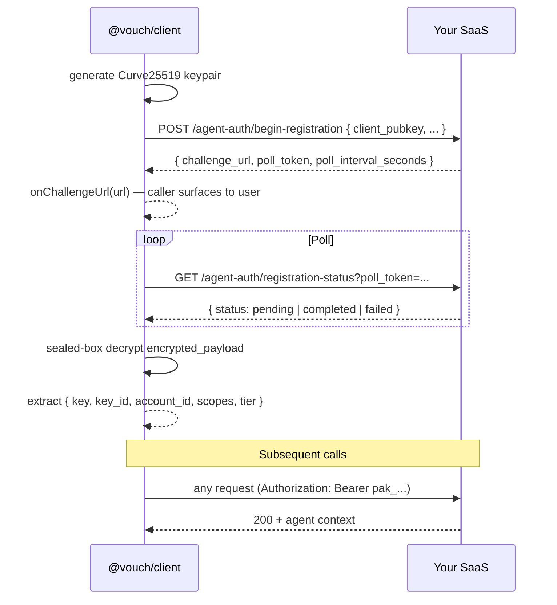

# Agent SDK (`@vouch/client`)

`@vouch/client` is the agent-side counterpart of the Vouch server. It wraps the registration flow (Curve25519 keypair generation, polling, sealed-box decrypt) and bearer-key handling so an agent can authenticate in **5 lines**.

## Install

```bash
npm install @vouch/client
```

`libsodium-wrappers` is bundled — you don't need to install it separately.

## One-shot register

```ts
import { register } from '@vouch/client';

const vouch = await register({
  saas_url: 'https://my-saas.com',
  provider: 'github_app',
  onChallengeUrl: (url) => console.log('Authorize at:', url),
});

const me = await vouch.fetch('/api/agent/v1/whoami').then((r) => r.json());
console.log(me); // { account_id, key_id, scopes, tier, ... }
```

`register()` returns a `VouchSession` with:
- `bearer` — the `pak_…` API key
- `key_id`, `account_id`, `scopes`, `tier`, `is_first_key`, `issued_at`
- `fetch(input, init?)` — `fetch`-compatible wrapper with `Authorization: Bearer …` injected

## Staged flow (manual control)

For cases where you want to surface the challenge URL synchronously and wait separately (printing a QR code, hand-off to mobile, etc.):

```ts
import { beginRegistration } from '@vouch/client';

const flow = await beginRegistration({
  saas_url: 'https://my-saas.com',
  provider: 'github_app',
});

console.log('Visit:', flow.challenge_url);
console.log('(expires:', flow.expires_at, ')');

const session = await flow.waitForCompletion({
  intervalMs: 2_000,
  timeoutMs: 10 * 60_000,
});

await session.fetch('/api/...');
```

## Persisting + rehydrating

For long-running agents, store `session.bearer / .key_id / .account_id` in the OS keychain and rebuild the session on the next run without re-registering:

```ts
import { fromBearer } from '@vouch/client';

const session = fromBearer({
  saas_url: 'https://my-saas.com',
  bearer: storedBearer,
  key_id: storedKeyId,
  account_id: storedAccountId,
});

await session.fetch('/api/agent/v1/whoami');
```

## Options

```ts
interface RegisterOptions {
  saas_url: string;                      // e.g. 'https://my-saas.com'
  provider: string;                      // e.g. 'github_app'
  intent?: 'register' | 'recover' | 'add_key';
  account_id?: string;                   // required for recover / add_key
  label?: string;                        // shown in admin UIs
  onChallengeUrl?: (url) => void | Promise<void>;
  path_prefix?: string;                  // default '/agent-auth'
  fetcher?: typeof fetch;                // for tests
  poll_interval_ms?: number;
  poll_timeout_ms?: number;              // default 5 minutes
}
```

## What the SDK does NOT do (yet)

- **Auto-rotation** — when the SaaS rotates a key (SPEC §2.7), the next request returns 401 with a rotation hint. The SDK doesn't re-register automatically; it'll be in v0.3. Catch the 401 and call `register()` again.
- **Webhook handling** — agent-side webhook routes are out of scope; agents handle 401s reactively.
- **Persistent storage** — caller's responsibility. Use the OS keychain.
- **Browser auto-open** — the SDK calls `onChallengeUrl(url)`; you decide whether to spawn `open` / `xdg-open` / log to console / pop a system tray notification.

## How it works (under the hood)


