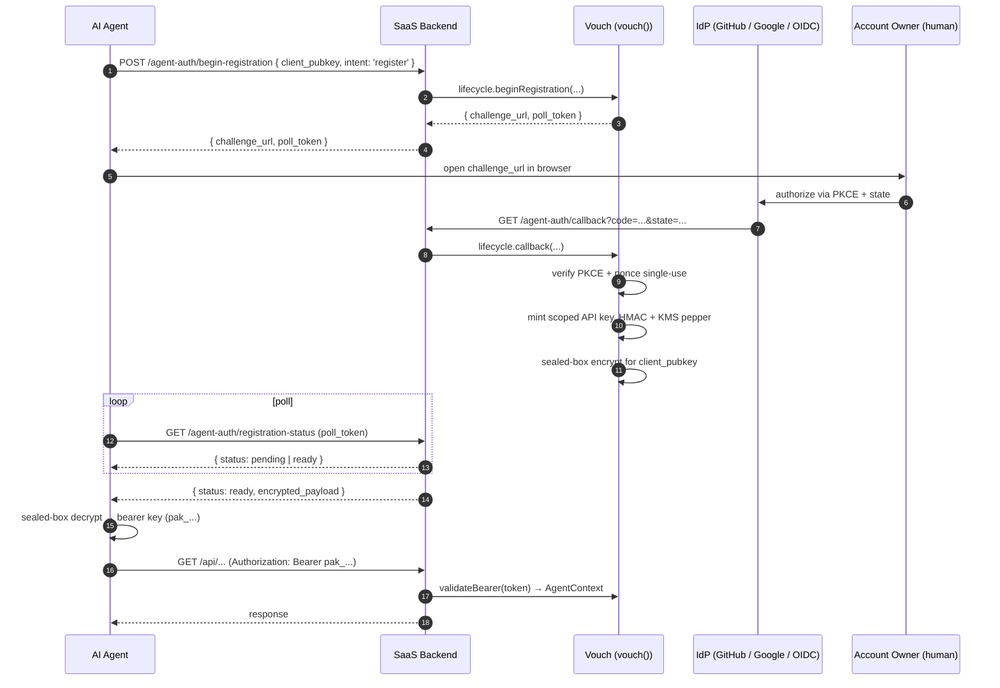

# Concepts

Vouch sits between an AI agent and a SaaS API. Here's the architecture in one screen.

## The pieces

| Component | Role | Why |
|---|---|---|
| **Postgres 16** | authoritative state — accounts, agents, keys, audit chain | Strong consistency, transactional safety. All Tier B writes use `synchronous_commit=remote_apply`. |
| **Redis 7** | cache (30 s bounded) + pubsub fan-out for revocations | Sub-millisecond hot path. Correctness never depends on Redis alone (RT-3, RT-26). |
| **AWS KMS** | pepper for HMAC; envelope keys for sealed-box delivery | Pepper rotates weekly; legacy versions accepted within a 7-day dual-window. |
| **AWS S3 (Object Lock)** | WORM mirror of audit chain | SOC 2 / GDPR — immutable evidence even against an admin-role attacker (RT-12, RT-39). |
| **Identity provider** | GitHub App, Google, generic OIDC | Default in v0.1; the lib is provider-agnostic — implement [`IdentityProvider`](https://github.com/shizhigu/agent-auth/blob/main/packages/vouch/src/types.ts) for any IdP. |

## Registration flow



## Why three stages of trust

Most auth libs have one stage: the bearer token. Vouch has three, each with a different time-to-live + threat surface:

1. **Identity attestation** — issued by the IdP at registration, recorded in `agent_identities`. Long-lived (days). Pseudonymized via HMAC + KMS pepper so a database leak doesn't reveal who's who (RT-9, RT-44).
2. **Bearer key** — the `pak_…` token the agent presents on every request. Short-lived (configurable; default ~30 days), rotatable, instantly revocable. Validated via HMAC + cache; cache-hit P99 ≈ 3 µs.
3. **Sealed-box delivery** — the bearer key only ever exists in plaintext at issue time, encrypted to the agent's public key. The SaaS never logs it; the agent decrypts client-side.

## Tier A vs Tier B

Two flavors of write:

- **Tier A** (single-row, idempotent by nature) — runs on the default `synchronous_commit=on`. Includes audit-row inserts, key-cache updates, etc.
- **Tier B** (high-stakes, network-blip-sensitive) — runs on `synchronous_commit=remote_apply` + two-phase idempotency. Includes key issuance, revocation, rotation, recovery confirms. Network blips during commit produce deterministic outcomes (`completed` / `failed` / `unknown`), never silent loss.

The `tierBIdempotent` wrapper is what turns a route into Tier B. Power users can call it directly; the lifecycle dispatcher does it automatically for the relevant routes.

## Role separation

Vouch ships **four Postgres roles**, used at different layers:

| Role | Used by | Permissions |
|---|---|---|
| `agent_auth_migrator` | one-shot DDL on deploy / `vouch migrate up` | full DDL, then dropped from the connection pool |
| `agent_auth_app` | request-path validation + Tier A reads | SELECT + INSERT on most tables; **no UPDATE / DELETE** on `agent_audit_log` |
| `agent_auth_admin` | admin runbooks (RB-1..RB-9) | privileged writes guarded by JIT-RBAC + two-person approval |
| `agent_auth_readonly` | reporting / forensics | SELECT only |

Per the threat model, the app role cannot tamper with audit history even if compromised — append is the only op it has.

## Why `req.agent` (not `req.user`)

Per [SPEC §6.3](https://github.com/shizhigu/agent-auth/blob/main/SPEC.md), the validate-key middleware sets `req.agent`, not `req.user`. The two are reserved slots:

```ts
app.use('/api/v1', humanAuth.middleware);     // sets req.user
app.use('/api/agent/v1', auth.express.middleware()); // sets req.agent

app.get('/api/agent/v1/data', (req, res) => {
  // req.user might also be set if the agent's caller is also a human;
  // but for our auth check we look at req.agent.
  return queryDb({ tenant_id: req.agent!.account_id });
});
```

This separation is a deliberate confused-deputy guard: a SaaS that authorizes on `req.user` for some routes and accepts an agent's bearer somewhere else can't accidentally cross-pollinate. RT-9 is closed by construction.

## What lives where in the codebase

```
agent-auth/                    ← repo root (npm workspaces)
├── packages/
│   ├── vouch/                 ← server core (npm: @vouch/server)
│   │   ├── src/factory.ts     vouch() + lifecycle dispatcher
│   │   ├── src/middleware/    validate-key + Express + Hono adapters
│   │   ├── src/storage/       Postgres + Redis + KMS adapters
│   │   ├── src/identity/      GitHubAppProvider + GoogleProvider + OidcProvider
│   │   ├── src/routes/        the 12 lifecycle handlers
│   │   ├── schema/migrations/ SQL DDL (0001..0006)
│   │   └── ...
│   ├── client/                @vouch/client — agent-side SDK
│   ├── cli/                   @vouch/cli — vouch migrate
│   └── create-vouch-app/      npx scaffolder
├── apps/
│   ├── demo/                  end-to-end demo
│   └── docs/                  this site (VitePress)
├── examples/                  Express / Hono / worker-cronjobs templates
└── audit/                     13 rounds of design audit history
```
