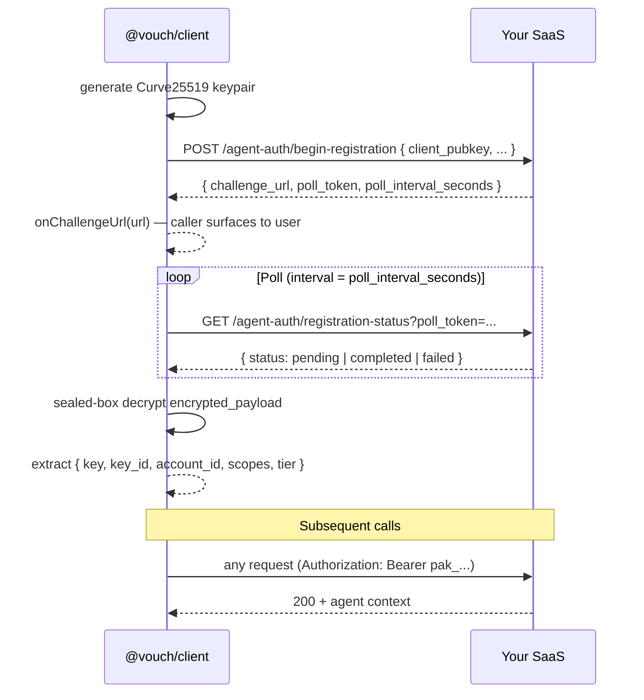

# @vouch/client

Agent-side SDK for [Vouch](https://github.com/shizhigu/agent-auth) — wraps the registration flow (PKCE keypair generation, polling, sealed-box decrypt) and bearer-key handling so an AI agent can authenticate in **5 lines**.

[](https://www.npmjs.com/package/@vouch/client)
[](../../LICENSE)

> **Status — v0.2 dev preview.** Not on npm yet; install from this repo.

## Why this exists

Without the SDK, an agent has to:

1. Generate a Curve25519 keypair
2. POST `/agent-auth/begin-registration` with the pubkey
3. Surface the `challenge_url` so the user can authorize on the IdP
4. Poll `/agent-auth/registration-status` until status='completed'
5. Sealed-box decrypt the encrypted_payload
6. Extract the bearer key (`pak_...`) and inject `Authorization: Bearer` on every request
7. Handle rotation, expiry, revocation hints

That's ~80 lines of crypto-aware code per agent. The SDK hides all of it.

## Install

```bash
npm install @vouch/client
```

`libsodium-wrappers` is bundled — you don't need to install it separately.

## Usage

### One-shot register (most common)

```ts
import { register } from '@vouch/client';

const vouch = await register({
  saas_url: 'https://my-saas.com',
  provider: 'github_app',
  onChallengeUrl: (url) => console.log('Authorize at:', url),
});

// vouch.fetch is fetch-compatible, with Bearer auto-injected.
const me = await vouch.fetch('/api/agent/v1/whoami').then((r) => r.json());
console.log(me); // { account_id, key_id, scopes, tier, ... }
```

### Staged flow (manual control over polling)

For cases where you want to surface the challenge URL synchronously and wait separately (e.g. printing a QR code, opening it in another window, or handing it to a mobile device):

```ts
import { beginRegistration } from '@vouch/client';

const flow = await beginRegistration({
  saas_url: 'https://my-saas.com',
  provider: 'github_app',
});

console.log('Visit:', flow.challenge_url);
console.log('(expires:', flow.expires_at, ')');

// Poll until done — interval / timeout are optional.
const session = await flow.waitForCompletion({
  intervalMs: 2_000,
  timeoutMs: 10 * 60_000,
});

await session.fetch('/api/...');
```

### Persisting + rehydrating

Store `session.bearer` somewhere safe (the OS keychain is ideal) and rebuild the session on the next run without re-registering:

```ts
import { fromBearer } from '@vouch/client';

const session = fromBearer({
  saas_url: 'https://my-saas.com',
  bearer: storedBearer,
  key_id: storedKeyId,
  account_id: storedAccountId,
});

await session.fetch('/api/agent/v1/whoami');
```

## API reference

```ts
register(options): Promise<VouchSession>
beginRegistration(options): Promise<RegistrationFlow>
fromBearer(options): VouchSession

interface VouchSession {
  bearer: string;        // pak_...
  key_id: string;
  account_id: string;
  scopes: ReadonlyArray<string>;
  tier: string;
  is_first_key: boolean;
  issued_at: string;
  fetch(input, init?): Promise<Response>;  // auto-injects Authorization
}
```

All options:

```ts
interface RegisterOptions {
  saas_url: string;                        // required, e.g. 'https://my-saas.com'
  provider: string;                        // required, e.g. 'github_app'
  intent?: 'register' | 'recover' | 'add_key';
  account_id?: string;                     // required for recover / add_key
  label?: string;                          // human label shown in admin UIs
  onChallengeUrl?: (url) => void | Promise<void>;
  path_prefix?: string;                    // default '/agent-auth'
  fetcher?: typeof fetch;                  // test injection
  poll_interval_ms?: number;               // default: server-recommended * 1000
  poll_timeout_ms?: number;                // default: 5 * 60_000 (5 min)
}
```

## What this SDK does NOT do (yet)

- **Auto-rotation** — when the SaaS rotates a key (SPEC §2.7), the next request returns 401 with a rotation hint. The SDK doesn't re-register automatically yet; v0.3.
- **Webhook handling** — agent-side webhook routes (e.g., revocation push) are out of scope; agents handle 401s reactively.
- **Persistent storage** — caller's responsibility. We expose `session.bearer` etc.; what you do with it (keychain, file, env var) is up to you.
- **Browser auto-open** — the SDK calls `onChallengeUrl(url)`; the caller decides whether to spawn `open` / `xdg-open` / log to console / pop a system tray notification.

## How it works (under the hood)



## License

[MIT](../../LICENSE) © 2026 Agentic Flow LLC
